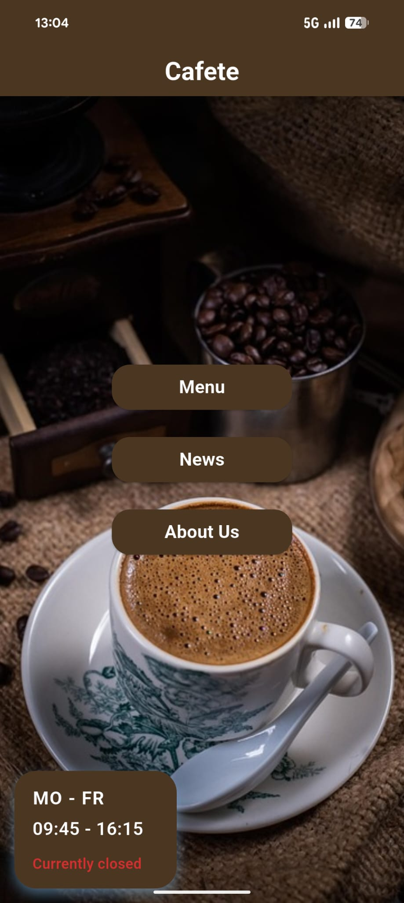

@Author: Tobias Steinkemper

@Contributions: Concept, App, Backend, Database, Frontend. 

@Author: Sophie <Nachname>
@Contributions: Sorting the menu by price, Database hygiene, Correction of typos.

When you contribute something you can put your name and what you did in there.

Small mobile-app for our student-cafe called "Cafete" (or some spell it Kafete). It provides basic static and dynamic info, like news, a menu, or if employees are in the Cafe at the time. 

The screenshot shows the homescreen. At the time the "Currently closed" or "Currently open" status have to be manually set. For the future a small project is planned, to detect if the door is open or not and automatically update the database.

